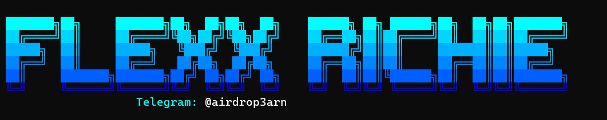

  

# 👋 Hi, I'm Flexx Richie

Full-stack & Web3 developer specializing in DeFi automation and web development solutions.

## 🛠️ Tech Stack

- **Web3**: Smart Contract Integration, DeFi Automation Scripts
- **Frontend**: NextJS, ReactJS, Vite
- **Backend**: Python, Django, NodeJS
- **Scripting**: Python Scripts, Shell Scripting, Node Scripts
- **Development Tools**: Git, VS Code, Docker
- **Other Skills**: REST APIs, Database Design, UI/UX

## 💻 Languages

  

## 💪 Expertise

- Developing automated farming scripts for DeFi protocols
- Creating efficient Web3 interaction scripts
- Building responsive web applications
- Backend system architecture
- Cross-chain integration and automation
- Token sniping and trading scripts

## 🌐 Connect With Me

## 📊 GitHub Stats

  
  

## 🎯 Current Focus

- Developing advanced DeFi automation tools
- Optimizing Web3 farming strategies
- Building scalable web applications
- Exploring new blockchain protocols
- Contributing to Web3 open-source projects

---

  <i>Let's connect and build something amazing together!</i>

