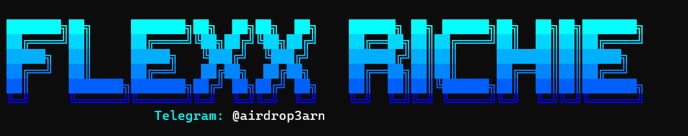

  

# 👋 Hi, I'm Flexx Richie

🚀 Full-stack & Web3 Developer | DeFi Automation Specialist | SaaS & eCommerce Builder | Desktop Application Developer

---

## 🌐 My Digital Presence

🌍 **Main Website:** [flexxrichie.xyz](https://flexxrichie.xyz)
💼 **Portfolio:** [portfolio.flexxrichie.xyz](https://portfolio.flexxrichie.xyz)

---

## 🛠️ Tech Stack

---

## 💼 Skills & Expertise

### 🧠 Web3 & DeFi Automation
- Smart contract integration and deployment
- Automated yield farming scripts and strategies
- Token sniping and trading bots with real-time analytics
- Cross-chain automation and bridging solutions
- MEV (Maximum Extractable Value) optimization tools

### 🖥️ Desktop Application Development
- Cross-platform executable applications
- Email automation and mass sender applications
- SMS to SMTP gateway solutions
- System integration and API connectivity
- User-friendly GUI development with modern frameworks

### 🌐 SaaS Development
- Building scalable, multi-tenant SaaS applications
- Microservices architecture and containerization
- API integrations and third-party services
- Cloud computing (AWS, GCP, Azure) and deployment
- Data management and security compliance (GDPR, SOC 2)
- MVP development and iterative scaling strategies

### 🛒 eCommerce Solutions
- Custom eCommerce platforms with advanced features
- CMS expertise: Shopify Plus, WordPress, Magento Commerce
- Payment gateway integrations (Stripe, PayPal, crypto payments)
- Performance optimization and technical SEO
- Conversion rate optimization and A/B testing
- Inventory management and supply chain integration

### 🖥️ Full-Stack Web Development
- Frontend: React.js, Next.js, Vue.js, TypeScript
- Backend: Node.js, Django, FastAPI, Express.js
- RESTful API and GraphQL design
- Database design (PostgreSQL, MongoDB, Redis)
- Responsive UI/UX design with modern frameworks
- Progressive Web Applications (PWA) development

### 🔐 DevOps & Security
- CI/CD pipeline automation
- Infrastructure as Code (Terraform, AWS CDK)
- Security auditing and penetration testing
- SSL/TLS implementation and certificate management
- Load balancing and performance monitoring

---

## 📊 GitHub Stats

  
  

---

## 💻 Top Languages

  

---

## 🏆 Recent Projects & Applications

### Desktop Applications
- **📧 Advanced Email Sender**: Multi-threaded email automation tool with template management
- **📱 SMS to SMTP Gateway**: Seamless SMS-to-email conversion application with logging
- **⚡ System Utilities Suite**: Collection of productivity-enhancing desktop tools

### Web Applications
- **🔗 Custom API Aggregation Platform**: Real-time data processing and visualization
- **💰 DeFi Portfolio Tracker**: Multi-chain asset monitoring with yield optimization
- **🛍️ Next-Gen eCommerce Solution**: Headless commerce platform with advanced analytics

---

## 🎯 Current Focus

- Advancing DeFi automation tools and yield optimization strategies
- Scaling SaaS applications with robust, cloud-native architectures
- Developing sophisticated desktop applications for business automation
- Enhancing eCommerce platforms with AI-driven personalization
- Exploring emerging blockchain protocols and Layer 2 solutions
- Contributing to open-source Web3 and automation projects
- Building cross-platform solutions that bridge web and desktop experiences

---

## 🌍 Connect With Me

---

## 📈 Professional Services

💼 **Available for:**
- Full-stack web development projects
- DeFi automation and Web3 integrations
- Custom SaaS application development
- Desktop application development
- eCommerce platform optimization
- Technical consulting and architecture reviews

---

  <i>💡 Let's connect, collaborate, and create something extraordinary together.</i>
    
  <strong>🚀 Ready to transform your ideas into powerful digital solutions</strong>

